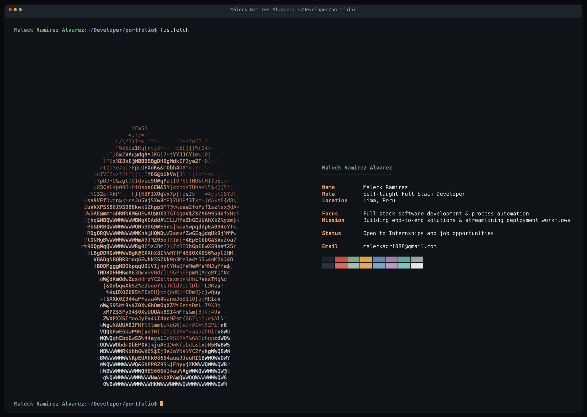

# Hola, soy Maleck 👋

## 🤝 Connect with me

   

## 🤝 My Favorite Tools

<picture>
  <source media="(prefers-color-scheme: dark)" srcset="https://raw.githubusercontent.com/MaleckRA/MaleckRA/output/github-contribution-grid-snake-dark.svg">
  <source media="(prefers-color-scheme: light)" srcset="https://raw.githubusercontent.com/MaleckRA/MaleckRA/output/github-contribution-grid-snake.svg">
  
</picture>
